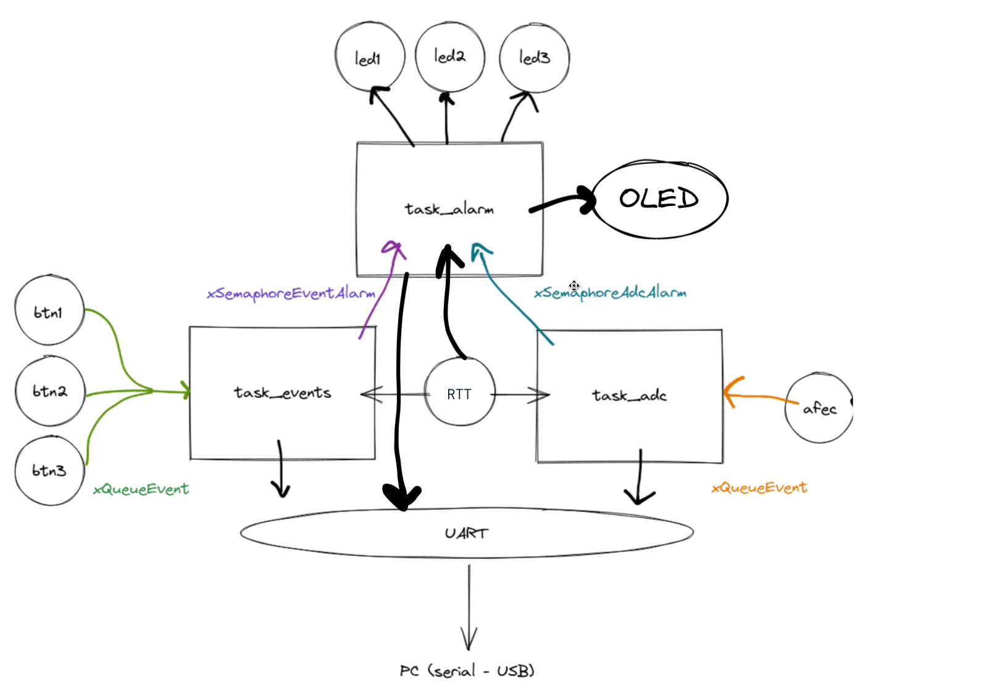

# 22a - Avaliação Prática 2

O que eu quero avaliar?

- Criacao de task
- Semáforo e fila
- IRQ
- UART
- Programacao C

Ideia: Dataloger

- Pode medir "temperatura"
- botões (como eventos)
   - (quando abriu quando fechou)
- 

## Descrição

Vamos criar um protótipo de um dataloger, um sistema embarcado coleta periodicamente valores e eventos do mundo real, formata e envia para um dispositivo externo. O envio da informação será feito pela UART. 

## Visão geral do firmware

O firmware vai ser composto por três tasks: `task_adc`, `task_events` e `task_alarm` além de duas filas: `xQueueEvent` e `xQueueADC` e dois semáforos: `xSemaphoreEventAlarm` e `xSemaphoreAfecAlarm`. A ideia é que a cada evento de botão ou a cada novo valor do ADC um log formatado seja enviado pela UART (`printf`) e uma verificacão das condicoes de alarme checadas, se um alarme for detectado a `task_alarm` deve ser iniciada. O log que será enviado pela UART deve possuir um timestamp que indicará quando o dado foi lido pelo sistema embarcado (DIA:MES:ANO HORA:MINUTO:SEGUNDO).

A seguir mais detalhes de cada uma das tarefa:

### task_adc

| Recurso               | Explicacao                                           |
|-----------------------|------------------------------------------------------|
| RTC                   | Fornecer as informacões do TimeStamp                 |
| TC                    | Gerar o 1hz do AFEC                                  |
| AFEC                  | Leitura analógica                                    |
|                       |                                                      |
| `xQueueAFEC`          | Recebimento do valor do ADC                          |
| `xSemaphoreAfecAlarm` | Liberacao da `task_alarm` devido a condição de alarm |

A `task_adc` vai ser responsável por coletar dados de uma entrada analógica via AFEC (usando algum TC para a base de tempo), os dados devem ser enviados do *callback* do AFEC via a fila `xQueueADC` a uma taxa de uma amostra por segundo (1hz). A cada novo dado do AFEC a condicao de alarme deve ser verificada.

A task, ao receber os dados deve realizar a seguinte acao:

1. Enviar pela UART o novo valor no formato a seguir:
    - `[AFEC ] DD:MM:YYYY HH:MM:SS $VALOR` (`$VALOR` deve ser o valor lido no AFEC)
1. Verificar a condicão de alarme:
    - 15 segundos com AFEC maior que 3000
    
Caso a condicao de alarme seja atingida liberar o semáforo `xSemaphoreAfecAlarm`.

### task_event 

| Recurso                | Explicacao                                           |
|------------------------|------------------------------------------------------|
| RTC                    | Fornecer as informações do TimeStamp                 |
| PIO                    | Leitura dos botões                                   |
|                        |                                                      |
| `xQueueEvent`          | Recebimento dos eventos de botão                     |
| `xSemaphoreEventAlarm` | Liberacao da `task_alarm` devido a condição de alarm |

A `task_event` será responsável por ler eventos de botão (subida, descida), para isso será necessário usar as interrupções nos botões e enviar pela fila `xQueueEvent` o ID do botão e o status (on/off). A cada evento a task deve formatar e enviar um log pela UART e também verificar a condição de alarme.

A task, ao receber os dados deve realizar a seguinte acao:

1. Enviar pela UART o novo valor no formato a seguir:
    - `[EVENT] DD:MM:YYYY HH:MM:SS $ID:$Status` (`$ID:$Status`: id do botão e status)
1. Verificar a condicão de alarme:
    - Dois botões pressionados ao mesmo tempo
    
Caso a condicao de alarme seja atingida liberar o semáforo `xSemaphoreEventAlarm`.

### task_alarm

| Recurso                | Explicacao                                 |
|------------------------|--------------------------------------------|
| PIO                    | Acionamento dos LEDs                       |
|                        |                                            |
| `xSemaphoreAfecAlarm`  | Indica alarme ativado deviado a task_afec  |
| `xSemaphoreEventAlarm` | Indica alarme ativado deviado a task_event |

